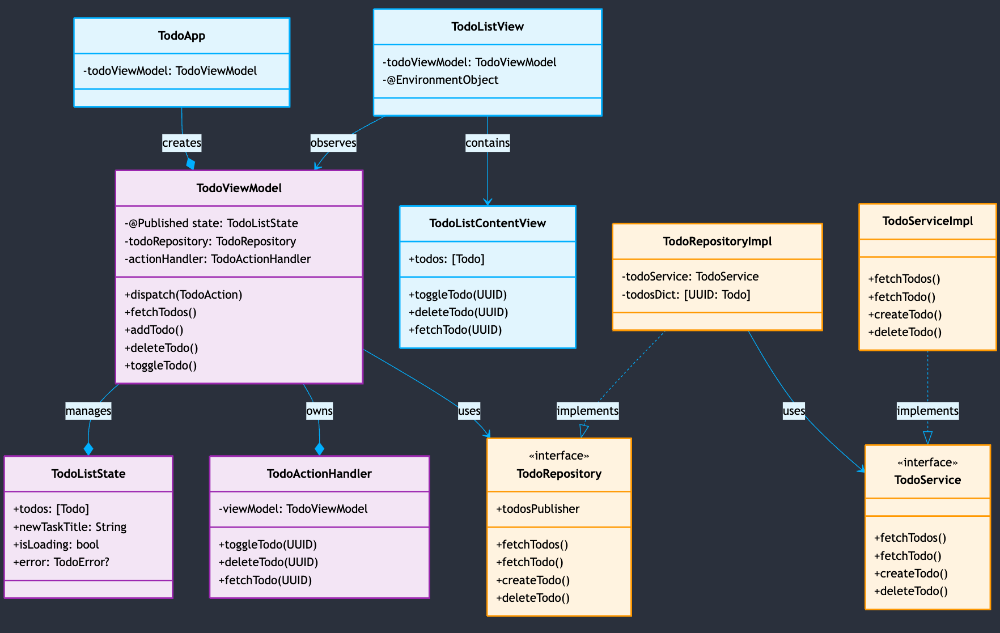

# swift-todo

A Todo app demonstrating clean MVVM architecture in SwiftUI
Features

## Features

- Unidirectional data flow
- Immutable state management
- Action Handler pattern for event management
- Reactive updates using Combine

## Architecture

The app follows a strict MVVM pattern with these key components:

- **Views**: Pure SwiftUI views driven by state
- **State**: Immutable state for predictable UI updates
- **ViewModel**: Manages business logic and state updates
- **Action Handler**: Bridges UI events to async actions
- **Repository**: Single source of truth for all data

